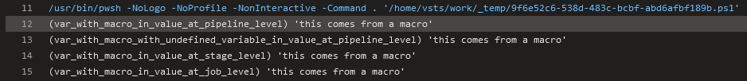
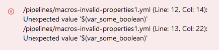
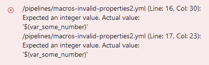
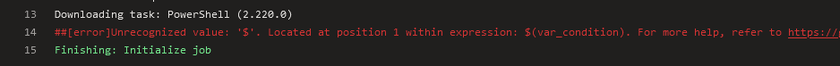

# Azure DevOps Battlefield

This GitHub repository aims to provide a comprehensive resource for learning Azure DevOps, specifically focusing on features such as templates and runtime expressions. The objective of this project is to offer a practical and methodical approach to understanding the complexities of Azure DevOps.

It is important to note that this repository does not claim to provide exhaustive documentation of all Azure DevOps features. Rather, it serves as a space for experimentation, learning, and gaining a deeper understanding of the features offered by Azure DevOps.

### Macros

[Documentation](https://learn.microsoft.com/en-us/azure/devops/pipelines/process/variables?view=azure-devops&tabs=yaml%2Cbatch#macro-syntax-variables):

> Macro syntax is designed to interpolate variable values into task inputs and into other variables.

- Macros can be used in the majority of task inputs, such as the "script".
- Macros can also be used in variable value definitions.
- Macros can be used in the "env" section.
- In general, macros cannot be used at the task property level.
- Macros can utilize UI-defined variables.
- Macros are evaluated lazily, variable definition order is not relevant.
- Nested expansion is supported.
- Variables referenced by macros can be defined using runtime expressions.
- Undefined variables preserve macro syntax in expansions.

#### Macros can be used in the majority of task inputs, such as the "script"

For `PowerShell@2` task it is possible to use for
[targetType](https://github.com/JakubLinhart/AzureDevOpsBattlefield/blob/5aa439679c34ae8a7dec235517d2d2c750ce7481/pipelines/macros.yml#L124), [workingDirectory](https://github.com/JakubLinhart/AzureDevOpsBattlefield/blob/5aa439679c34ae8a7dec235517d2d2c750ce7481/pipelines/macros.yml#L125C15-L125C31),
and [script](https://github.com/JakubLinhart/AzureDevOpsBattlefield/blob/5aa439679c34ae8a7dec235517d2d2c750ce7481/pipelines/macros.yml#L126) inputs (see [example output](https://linj.visualstudio.com/AzureDevOpsBattleground/_build/results?buildId=245&view=logs&j=0ab14b9f-e499-56d5-97b1-fd98b70ea339&t=3fa529ca-c925-5304-b42f-2bbd21f9750e)), 
but in general, it should be possible for any input of any task.

```yaml
  - task: PowerShell@2
    displayName: 'A task with macros in inputs'
    inputs:
      targetType: $(var_targetType)
      workingDirectory: $(var_workingDirectory)
      script: $(var_script)
```

#### Macros can also be used in variable value definitions

This is [possible](https://github.com/JakubLinhart/AzureDevOpsBattlefield/blob/5aa439679c34ae8a7dec235517d2d2c750ce7481/pipelines/macros.yml#L20):

```yaml
  - name: var_with_value_for_another_value
    value: 'this comes from a macro'
  - name: var_with_macro_in_value_at_pipeline_level
    value: '$(var_with_value_for_another_value)'
```

[](https://linj.visualstudio.com/AzureDevOpsBattleground/_build/results?buildId=245&view=logs&j=0ab14b9f-e499-56d5-97b1-fd98b70ea339&t=f064c65f-5d7b-5dd9-a2c0-b27c2b3dbefa&l=12)

#### Macros can be used in the "env" section.

`env` section is at the properties level, but it is the same exception as `inputs`. 

```yaml
  - pwsh: |
    Write-Output "my_environment_variable: '$env:my_environment_variable'"
  displayName: 'A task with macro in env'
  env:
    my_environment_variable: $(var_my_environment_variable)
```

[](https://linj.visualstudio.com/AzureDevOpsBattleground/_build/results?buildId=245&view=logs&j=0ab14b9f-e499-56d5-97b1-fd98b70ea339&t=67bb029a-943e-5196-8d89-e7392cea21c1&l=12)

#### In general, macros cannot be used at the task property level

If you try to use macros in boolean properties, for [example](https://github.com/JakubLinhart/AzureDevOpsBattlefield/blob/0d6ece87a31d8ddb1c5dbc4600ada07e661d31d8/pipelines/macros-invalid-properties1.yml):

```yaml
variables:
  - name: var_some_boolean
    value: true

steps:
  - pwsh: Write-Output 'some step'
    displayName: 'A task with macros in properties'
    enabled: '$(var_some_boolean)'
    continueOnError: $(var_some_boolean)
```

then the [pipeline](https://linj.visualstudio.com/AzureDevOpsBattleground/_build?definitionId=11) doesn't even start and you get this error:



If you try to use macros in integer properties, for [example](https://github.com/JakubLinhart/AzureDevOpsBattlefield/blob/4c4ba82de8ba0ba95ec74f380e01e3c1a8eed4fe/pipelines/macros-invalid-properties2.yml):

```yaml
  variables:
  - name: var_some_number
    value: 3

  steps:
    - pwsh: Write-Output 'some step'
      retryCountOnTaskFailure: $(var_some_number)
      timeoutInMinutes: $(var_some_number)
```

then the [pipeline](https://linj.visualstudio.com/AzureDevOpsBattleground/_build?definitionId=12&_a=summary) doesn't even start and you get this error:



If you try to use a macro in a condition, for [example](https://github.com/JakubLinhart/AzureDevOpsBattlefield/blob/main/pipelines/macros-invalid-properties3.yml):

```yaml
  variables:
    - name: var_condition
      value: always()

  steps:
    - pwsh: Write-Output 'some step'
      displayName: 'A task with macros in properties'
      condition: $(var_condition)
```

then the pipeline starts but the initialization job fails with an error:

[](https://linj.visualstudio.com/AzureDevOpsBattleground/_build/results?buildId=246&view=logs&j=12f1170f-54f2-53f3-20dd-22fc7dff55f9&t=e0f977f9-ef87-4bf0-b7e2-aeee2c074101&l=14)

#### Macros can utilize UI-defined variables

#### Macros are evaluated lazily, variable definition order is not relevant

Variable definitions can contain macros with variables that are not defined yet. For example, you can use a job-level variable when defining a stage-level variable, as long as both variables exist during the final evaluation.

#### Nested expansion is supported

#### Variables referenced by macros can be defined using runtime expressions

#### Undefined variables preserve macro syntax in expansions

`$(undefined_variable)` is expanded to `$(undefined_variable)` when `undefined_variable` is not defined.
[Example](https://github.com/JakubLinhart/AzureDevOpsBattlefield/blob/5aa439679c34ae8a7dec235517d2d2c750ce7481/pipelines/macros.yml#L68):

```yaml
  Write-Output '(undefined_variable) ''$(undefined_variable)'''
```

[](https://linj.visualstudio.com/AzureDevOpsBattleground/_build/results?buildId=245&view=logs&j=0ab14b9f-e499-56d5-97b1-fd98b70ea339&t=5e8f27c5-64d0-5083-9c85-d2ff9773c863&l=16)

### Runtime expressions

### Template expressions

### Template parameters
