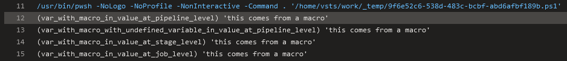

# Macros

## Macros can be used in the majority of task inputs, such as the "script"

For `PowerShell@2` task it is possible to use for
[targetType](https://github.com/JakubLinhart/AzureDevOpsBattlefield/blob/5aa439679c34ae8a7dec235517d2d2c750ce7481/pipelines/macros.yml#L124), [workingDirectory](https://github.com/JakubLinhart/AzureDevOpsBattlefield/blob/5aa439679c34ae8a7dec235517d2d2c750ce7481/pipelines/macros.yml#L125C15-L125C31),
and [script](https://github.com/JakubLinhart/AzureDevOpsBattlefield/blob/5aa439679c34ae8a7dec235517d2d2c750ce7481/pipelines/macros.yml#L126) inputs (see [example output](https://linj.visualstudio.com/AzureDevOpsBattleground/_build/results?buildId=245&view=logs&j=0ab14b9f-e499-56d5-97b1-fd98b70ea339&t=3fa529ca-c925-5304-b42f-2bbd21f9750e)), 
but in general, it should be possible for any input of any task.

```yaml
  - task: PowerShell@2
    displayName: 'A task with macros in inputs'
    inputs:
      targetType: $(var_targetType)
      workingDirectory: $(var_workingDirectory)
      script: $(var_script)
```

## Macros can also be used in variable value definitions

This is [possible](https://github.com/JakubLinhart/AzureDevOpsBattlefield/blob/5aa439679c34ae8a7dec235517d2d2c750ce7481/pipelines/macros.yml#L20):

```yaml
  - name: var_with_value_for_another_value
    value: 'this comes from a macro'
  - name: var_with_macro_in_value_at_pipeline_level
    value: '$(var_with_value_for_another_value)'
```

[](https://linj.visualstudio.com/AzureDevOpsBattleground/_build/results?buildId=245&view=logs&j=0ab14b9f-e499-56d5-97b1-fd98b70ea339&t=f064c65f-5d7b-5dd9-a2c0-b27c2b3dbefa&l=12)

## Macros can be used in the "env" section

`env` section is at the task properties level, but it is the same exception as `inputs`. 

```yaml
  - pwsh: |
    Write-Output "my_environment_variable: '$env:my_environment_variable'"
  displayName: 'A task with macro in env'
  env:
    my_environment_variable: $(var_my_environment_variable)
```

[](https://linj.visualstudio.com/AzureDevOpsBattleground/_build/results?buildId=245&view=logs&j=0ab14b9f-e499-56d5-97b1-fd98b70ea339&t=67bb029a-943e-5196-8d89-e7392cea21c1&l=12)

## In general, macros cannot be used at the task property level

If you try to use macros in boolean properties, for [example](https://github.com/JakubLinhart/AzureDevOpsBattlefield/blob/0d6ece87a31d8ddb1c5dbc4600ada07e661d31d8/pipelines/macros-invalid-properties1.yml):

```yaml
variables:
  - name: var_some_boolean
    value: true

steps:
  - pwsh: Write-Output 'some step'
    displayName: 'A task with macros in properties'
    enabled: '$(var_some_boolean)'
    continueOnError: $(var_some_boolean)
```

then the [pipeline](https://linj.visualstudio.com/AzureDevOpsBattleground/_build?definitionId=11) doesn't even start and you get this error:


If you try to use macros in integer properties, for [example](https://github.com/JakubLinhart/AzureDevOpsBattlefield/blob/4c4ba82de8ba0ba95ec74f380e01e3c1a8eed4fe/pipelines/macros-invalid-properties2.yml):

```yaml
  variables:
  - name: var_some_number
    value: 3

  steps:
    - pwsh: Write-Output 'some step'
      retryCountOnTaskFailure: $(var_some_number)
      timeoutInMinutes: $(var_some_number)
```

then the [pipeline](https://linj.visualstudio.com/AzureDevOpsBattleground/_build?definitionId=12&_a=summary) doesn't even start and you get this error:


If you try to use a macro in a `condition` task property, for [example](https://github.com/JakubLinhart/AzureDevOpsBattlefield/blob/main/pipelines/macros-invalid-properties3.yml):

```yaml
  variables:
    - name: var_condition
      value: always()

  steps:
    - pwsh: Write-Output 'some step'
      displayName: 'A task with macros in properties'
      condition: $(var_condition)
```

then the pipeline starts but the initialization job fails with an error:

[](https://linj.visualstudio.com/AzureDevOpsBattleground/_build/results?buildId=246&view=logs&j=12f1170f-54f2-53f3-20dd-22fc7dff55f9&t=e0f977f9-ef87-4bf0-b7e2-aeee2c074101&l=14)

If you try to use a macro in a `displayName` task property then there is no error but the macro is not evaluated. For [example](https://github.com/JakubLinhart/AzureDevOpsBattlefield/blob/9c194652fa23fd63230e65d6765e69a91687fc91/pipelines/macros.yml#L80):

```yaml
  - pwsh: Write-Output 'some step'
    displayName: '(var_defined_at_pipeline_level) $(var_defined_at_pipeline_level)'
```

is not expanded at all, so you get a task with this name:

[](https://dev.azure.com/linj/AzureDevOpsBattleground/_build/results?buildId=247&view=logs&j=0ab14b9f-e499-56d5-97b1-fd98b70ea339&t=f2293c27-2d42-546b-fdc3-f93463ef70fa)

## Macros can utilize UI-defined variables

Why is it important to mention this fact? Because it highlights an important distinction from template expressions: they are unable to use variables defined at the UI level.

If `var_defined_at_ui_level` is defined on the [UI level](https://dev.azure.com/linj/AzureDevOpsBattleground/_apps/hub/ms.vss-build-web.ci-designer-hub?pipelineId=10&branch=main&nonce=HGlMs1aI5oNaFTk1n7Zwcw%3D%3D):


then you can always do for [example](https://github.com/JakubLinhart/AzureDevOpsBattlefield/blob/9c194652fa23fd63230e65d6765e69a91687fc91/pipelines/macros.yml#L57C16-L57C16) this:

```yaml
  - pwsh: |
      Write-Output '(var_defined_at_ui_level) ''$(var_defined_at_ui_level)'''
```

[](https://dev.azure.com/linj/AzureDevOpsBattleground/_build/results?buildId=247&view=logs&j=0ab14b9f-e499-56d5-97b1-fd98b70ea339&t=5e8f27c5-64d0-5083-9c85-d2ff9773c863&l=12)


## Macros are evaluated lazily, variable definition order is not relevant

Variable definitions can contain macros with variables that are not defined yet. For example, you can use a job-level variable when defining a stage-level variable, as long as both variables exist during the final evaluation. For [example]([TBD](https://github.com/JakubLinhart/AzureDevOpsBattlefield/blob/3809e67afa8b7f57a1f439ee9d293e9f8103ff94/pipelines/macros.yml#L69)):

```yaml
variables:
  - name: var_with_macro_with_variable_defined_at_job_level_in_value_at_pipeline_level
    value: 'this part was defined at pipliene level, $(var_with_value_for_another_value_at_job_level)'

stages:
  - stage: stage1
    jobs:
      - job: job1
        variables:
          - name: var_with_value_for_another_value_on_job_level
            value: 'this part was defined at job level'

        steps:
          - pwsh: |
              Write-Output '(var_with_macro_with_variable_defined_at_job_level_in_value_at_pipeline_level) ''$(var_with_macro_with_variable_defined_at_job_level_in_value_at_pipeline_level)'''
```

`var_with_macro_with_variable_defined_at_job_level_in_value_at_pipeline_level` is defined before `var_with_value_for_another_value_on_job_level` and the variable is evaluated in the right way:

[](https://dev.azure.com/linj/AzureDevOpsBattleground/_build/results?buildId=247&view=logs&j=0ab14b9f-e499-56d5-97b1-fd98b70ea339&t=f064c65f-5d7b-5dd9-a2c0-b27c2b3dbefa&l=16)

## Nested evaluation is NOT supported

Macros cannot contain sub-macros, for [example](https://github.com/JakubLinhart/AzureDevOpsBattlefield/blob/b716cb4d3302f7bfbf095bc7f7c26b0d1024df25/pipelines/macros.yml#L73):

```yaml
  variables:
    - name: variable_name_fragment
        value: 'with_value'
    - name: var_with_value_for_another_value
        value: 'this comes from a macro'

  - steps:
    - pwsh: |
        Write-Output '(var_(variable_name_fragment)_for_another_value) ''$(var_$(variable_name_fragment)_for_another_value)'''
```

and the output shows that only inner macro is evaluated:

[](https://dev.azure.com/linj/AzureDevOpsBattleground/_build/results?buildId=247&view=logs&j=0ab14b9f-e499-56d5-97b1-fd98b70ea339&t=bd5b3379-fc2b-58be-675b-6db955a3e723&l=12)

## Variables referenced by macros can be defined using runtime expressions

TBD

## Undefined variables preserve macro syntax in expansions

`$(undefined_variable)` is expanded to `$(undefined_variable)` when `undefined_variable` is not defined.
[Example](https://github.com/JakubLinhart/AzureDevOpsBattlefield/blob/5aa439679c34ae8a7dec235517d2d2c750ce7481/pipelines/macros.yml#L68):

```yaml
  Write-Output '(undefined_variable) ''$(undefined_variable)'''
```

[](https://linj.visualstudio.com/AzureDevOpsBattleground/_build/results?buildId=245&view=logs&j=0ab14b9f-e499-56d5-97b1-fd98b70ea339&t=5e8f27c5-64d0-5083-9c85-d2ff9773c863&l=16)
