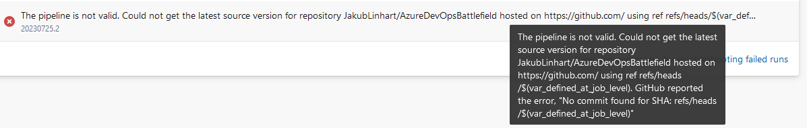
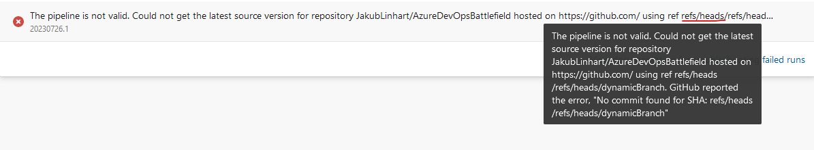
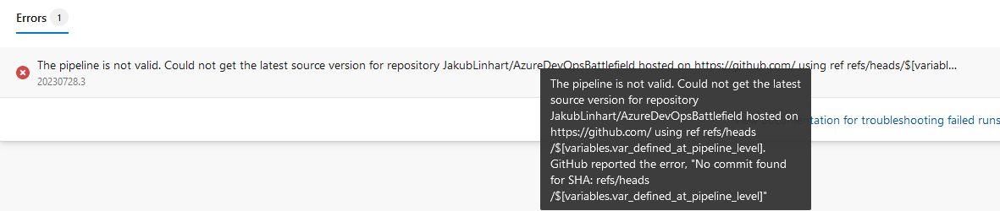
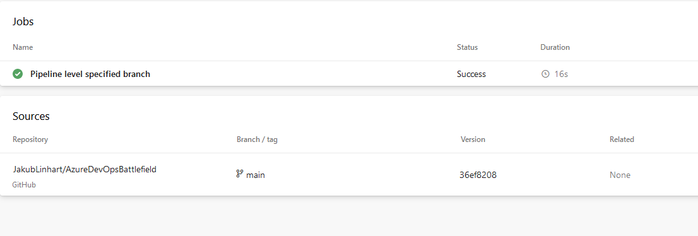
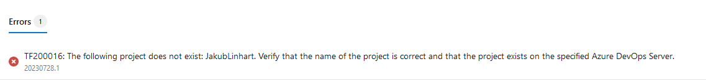
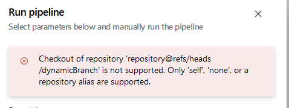

# Repositories

## A repository resource branch can be defined by a macro

Consider this repository [resource definition](https://github.com/JakubLinhart/AzureDevOpsBattlefield/blob/7d7dfd142da3b49e5104745b0e58a24ef03bf958/pipelines/repository-macros.yml#L15-L19):

```yaml
resources:
  repositories:
    - repository: dynamic-repository
      type: github
      endpoint: JakubLinhart
      name: JakubLinhart/AzureDevOpsBattlefield
      ref: $(var_defined_at_ui_level)
```

Then if you define `var_defined_at_ui_level` at the UI level, the macro is evaluated at compile time. In such a case Azure DevOps supposes that the variable contains a branch name and prepends `refs/heads/` to the variable value, resolves such `ref` to a specific commit which leads to a repository with a detached head:

[](https://linj.visualstudio.com/AzureDevOpsBattleground/_build/results?buildId=357&view=logs&j=011e1ec8-6569-5e69-4f06-baf193d1351e&t=0f4aa080-c997-58ca-481c-4930865ae0f8&l=13)

This also means that macros at this level are evaluated after template expressions since template expressions are evaluated even before UI-defined variables are defined (see [UI-defined variables are unavailable in template expressions](template-expressions.md#ui-defined-variables-are-unavailable-in-template-expressions)).

The same works also for variables defined at the [pipeline level](https://github.com/JakubLinhart/AzureDevOpsBattlefield/blob/7d7dfd142da3b49e5104745b0e58a24ef03bf958/pipelines/repository-macros.yml#L21-L25).

## A repository resource branch cannot be defined by a macro with job-level variable

You cannot use variables defined at the [job level](https://github.com/JakubLinhart/AzureDevOpsBattlefield/blob/7d7dfd142da3b49e5104745b0e58a24ef03bf958/pipelines/repository-macros-job-level-invalid.yml), because they don't exist yet and you get:

[](https://linj.visualstudio.com/AzureDevOpsBattleground/_build/results?buildId=358&view=results).

## A repository resource branch defined by macro gets `refs/heads/` prefix

Azure DevOps adds `refs/heads/` prefix to a `ref` defined by a macro. This means that you cannot specify a commit hash directly. For [example](https://github.com/JakubLinhart/AzureDevOpsBattlefield/blob/30f7fb7b23246c46d0f817042bf1191e0380655f/pipelines/repository-macros-prefix-invalid.yml):

```yaml
variables:
  - name: var_defined_at_pipeline_level
    value: refs/heads/dynamicBranch

resources:
  repositories:
    - repository: dynamic-repository-pipeline-level
      type: github
      endpoint: JakubLinhart
      name: JakubLinhart/AzureDevOpsBattlefield
      ref: $(var_defined_at_pipeline_level)
```

leads to:

[](https://linj.visualstudio.com/AzureDevOpsBattleground/_build/results?buildId=362&view=results)

## A repository resource branch cannot be defined by a runtime expression

If you try to define a repository resource branch by a [runtime expression](https://github.com/JakubLinhart/AzureDevOpsBattlefield/blob/5ff61b5bf495469f3d70d4164bb89bc4ab55661e/pipelines/repository-runtime-expressions-invalid.yml#L14):

```yaml
variables:
  - name: var_defined_at_pipeline_level
    value: dynamicBranch

resources:
  repositories:
    - repository: dynamic-repository
      type: github
      endpoint: JakubLinhart
      name: JakubLinhart/AzureDevOpsBattlefield
      ref: $[variables.var_defined_at_pipeline_level]

steps:
  - checkout: dynamic-repository
```

you get this error when you try to run such a pipeline:

[](https://dev.azure.com/linj/AzureDevOpsBattleground/_build/results?buildId=388&view=results)

## A repository resource branch cannot be defined by a template expression

Consider a repository resource branch defined by [a template expression](https://github.com/JakubLinhart/AzureDevOpsBattlefield/blob/36ef8208c11b9353b6091f1b2445d8bfe16a766c/pipelines/repository-template-expressions.yml#L9-L19):

```yaml
variables:
  - name: var_defined_at_pipeline_level
    value: refs/heads/dynamicBranch

resources:
  repositories:
    - repository: dynamic-repository-pipeline-level
      type: github
      endpoint: JakubLinhart
      name: JakubLinhart/AzureDevOpsBattlefield
      ref: ${{ variables.var_defined_at_pipeline_level }}
```

then there is no error when you try to start such a pipeline but the repository branch is evaluated as an unknown and the repository resource is ignored completely:

[](https://dev.azure.com/linj/AzureDevOpsBattleground/_build/results?buildId=398&view=results)

This is a clue that repositories are parsed even before templates expressions evaluation.

## Azure DevOps ignores repository resources with invalid branch

## Inline checkout syntax cannot be used for GitHub

Consider this [inline checkout](https://github.com/JakubLinhart/AzureDevOpsBattlefield/blob/31c6ae47742579e7242cb68cdfa082b41c2dece1/pipelines/repository-inline-syntax-with-github-invalid.yml#L13):

```yaml
steps:
  - checkout: git://JakubLinhart/AzureDevOpsBattlefield@dynamicBranch
```

then an attempt to run such a pipeline results in an error:

[](https://dev.azure.com/linj/AzureDevOpsBattleground/_build/results?buildId=379&view=results)

This is well documented in official [Azure DevOps documentation](https://learn.microsoft.com/en-us/azure/devops/pipelines/repos/multi-repo-checkout?view=azure-devops#inline-syntax-checkout).

> Only Azure Repos Git repositories in the same organization can use the inline syntax. Azure Repos Git repositories in a different organization, and other supported repository types require a service connection and must be declared as a repository resource.

## A repository resource cannot be combined with inline checkout

An attempt to combine a repository resource with [inline checkout syntax](https://github.com/JakubLinhart/AzureDevOpsBattlefield/blob/5d3efca7cb77bcf1a4548e3ff68634d965b803d8/pipelines/repository-resource-with-inline-syntax-invalid.yml#L9-L20):

```yaml
resources:
  repositories:
    - repository: repository
      type: github
      endpoint: JakubLinhart
      name: JakubLinhart/AzureDevOpsBattlefield

jobs:
  - job: job1
    displayName: Inline syntax combined with repository resource
    steps:
      - checkout: repository@refs/heads/dynamicBranch
```

If you try to start such a pipeline, you will get this error:

