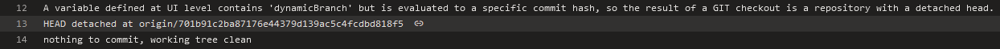

# Repositories

## A repository resource branch can be defined by a macro

Consider this repository [resource definition](https://github.com/JakubLinhart/AzureDevOpsBattlefield/blob/bd73211795b2bf57eedc727efe5f23ed97fe9c86/pipelines/macros-repository.yml#L11):

```yaml
resources:
  repositories:
    - repository: dynamic-repository
      type: github
      endpoint: JakubLinhart
      name: JakubLinhart/AzureDevOpsBattlefield
      ref: $(var_defined_at_ui_level)
```

Then if you define `var_defined_at_ui_level` at the UI level, the macro is evaluated at compile time. In such a case Azure DevOps supposes that the variable contains a branch name and prepends `refs/heads/` to the variable value, resolves such `ref` to a specific commit which leads to a repository with a detached head:

[](https://linj.visualstudio.com/AzureDevOpsBattleground/_build/results?buildId=346&view=logs&j=7f33e5bd-7764-5d8a-ba2e-506e078b9c3f&t=b90fe04d-084a-5ebe-1240-ecd857f5e241&l=13)

This also means that macros at this level are evaluated after template expressions since template expressions are evaluated even before UI-defined variables are defined (see [UI-defined variables are unavailable in template expressions](template-expressions.md#ui-defined-variables-are-unavailable-in-template-expressions)).

The same works also for variables defined at the [pipeline level](https://github.com/JakubLinhart/AzureDevOpsBattlefield/blob/bd73211795b2bf57eedc727efe5f23ed97fe9c86/pipelines/macros-repository.yml#L21).

## A repository resource branch cannot be defined by a macro with job-level variable

You cannot use variables defined at the [job level](https://github.com/JakubLinhart/AzureDevOpsBattlefield/blob/f956fbc5cc6379d514e3dc6367305e4a7de81684/pipelines/macros-repository-job-level-invalid.yml), because they don't exist yet and you get:

[](https://linj.visualstudio.com/AzureDevOpsBattleground/_build/results?buildId=350&view=results).

## A repository resource branch defined by macro gets `refs/heads/` prefix

Thanks to the `refs/heads/` prefix, you cannot specify a commit hash directly. TBD
