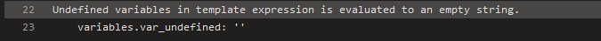
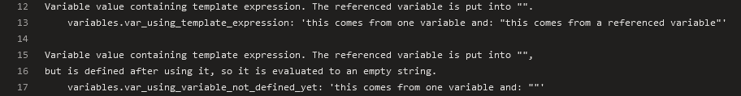
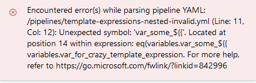

# Template expressions (aka compile-time expressions)

## Usable on the left side of a key

This allows you to define a task name using a variable. For [example](https://github.com/JakubLinhart/AzureDevOpsBattlefield/blob/9db84151d6a37aae91ebda190ad7ac7c662a51f7/pipelines/template-expressions.yml#L73):

```yaml
variables:
  - name: var_task_name
    value: 'pwsh'

steps:
  - ${{ variables.var_task_name }}: Write-Output 'Hello from a task defined by template expression.'
    displayName: The task name is defined by a template expression
```

Then the output is:

[](https://dev.azure.com/linj/AzureDevOpsBattleground/_build/results?buildId=260&view=logs&j=0ab14b9f-e499-56d5-97b1-fd98b70ea339&t=bd5b3379-fc2b-58be-675b-6db955a3e723).

## An undefined variable is evaluated as an empty string

For [example](https://github.com/JakubLinhart/AzureDevOpsBattlefield/blob/9db84151d6a37aae91ebda190ad7ac7c662a51f7/pipelines/template-expressions.yml#L54):

```yaml
  - pwsh: |
      Write-Output ''
      Write-Output 'Undefined variables in template expression is evaluated to an empty string.'
      Write-Output '    variables.var_undefined: ''${{ variables.var_undefined }}'''
```

and the output is:

[](https://dev.azure.com/linj/AzureDevOpsBattleground/_build/results?buildId=262&view=logs&j=0ab14b9f-e499-56d5-97b1-fd98b70ea339&t=5e8f27c5-64d0-5083-9c85-d2ff9773c863&l=22)

## UI-defined variables are unavailable in template expressions

In Azure DevOps, template expressions are evaluated before the variables defined at the UI level are included. However, UI-defined variables are accessible for both [runtime expressions](/#runtime-expressions) and [macros](/#macros).

If you have a variable defined at the UI level:


then for [example](https://github.com/JakubLinhart/AzureDevOpsBattlefield/blob/9db84151d6a37aae91ebda190ad7ac7c662a51f7/pipelines/template-expressions.yml#L51C82-L51C106):

```yaml
  - pwsh: |
      Write-Output ''
      Write-Output 'Template expressions are evaluated before UI variables are defined, so it is not possible to use them in template expressions.'
      Write-Output '    variables.var_defined_at_ui_level: ${{ variables.var_defined_at_ui_level }}'
```

produces this output:

[](https://dev.azure.com/linj/AzureDevOpsBattleground/_build/results?buildId=262&view=logs&j=0ab14b9f-e499-56d5-97b1-fd98b70ea339&t=5e8f27c5-64d0-5083-9c85-d2ff9773c863&l=19)

## The order of variable definitions is important

Consider this [example](https://github.com/JakubLinhart/AzureDevOpsBattlefield/blob/fc5fe379579f4d57d2480141c362f6e8dfdf487b/pipelines/template-expressions.yml#L10-L15):

```yaml
  variables:
    - name: var_using_variable_not_defined_yet
      value: 'this comes from one variable and: "${{ variables.var_for_other_variable }}"'
    - name: var_for_other_variable
      value: 'this comes from a referenced variable'
    - name: var_using_template_expression
      value: 'this comes from one variable and: "${{ variables.var_for_other_variable }}"'
  
  steps:
    - pwsh: |
        Write-Output 'Variable value containing template expression. The referenced variable is put into "".'
        Write-Output '    variables.var_using_template_expression: ''${{ variables.var_using_template_expression }}'''
    
        Write-Output ''
        Write-Output 'Variable value containing template expression. The referenced variable is put into "",'
        Write-Output 'but is defined after using it, so it is evaluated to an empty string.'
        Write-Output '    variables.var_using_variable_not_defined_yet: ''${{ variables.var_using_variable_not_defined_yet }}'''
```

The variable `var_using_variable_not_defined_yet` is defined with a reference to another variable `var_for_other_variable`, which is defined after `var_using_variable_not_defined_yet`. As a result, `var_using_variable_not_defined_yet` is evaluated as an empty string. On the other hand, `var_using_template_expression` correctly utilizes `var_for_other_variable`, which is already known at that point and thus evaluated correctly.

So the output for this example looks like this:

[](https://dev.azure.com/linj/AzureDevOpsBattleground/_build/results?buildId=266&view=logs&j=0ab14b9f-e499-56d5-97b1-fd98b70ea339&t=5e8f27c5-64d0-5083-9c85-d2ff9773c863&l=12)

## Nested evaluation is NOT supported

If you try to start a [pipeline](https://github.com/JakubLinhart/AzureDevOpsBattlefield/blob/bffef5b3de5e94c85905867aaa2e757a8b0ea817/pipelines/template-expressions-nested-invalid.yml) with similar yaml:

```yaml
  variables:
    - name: var_some_number
      value: 3
    - name: var_some_second_number
      value: 3
    - name: var_for_crazy_template_expression
      value: 'number, variables.var'
    - name: var_template_expression_containing_crazy_compile_expression
      value: ${{ eq(variables.var_some_${{ variables.var_for_crazy_template_expression }}_some_second_number) }}

  steps:
    - pwsh: echo 'Just some step'
```

then an attempt to start the pipeline ends with an error:

