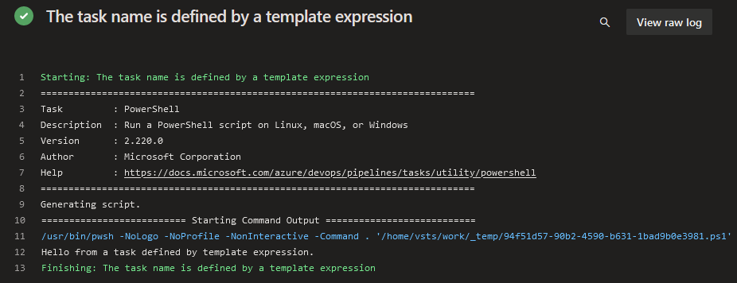
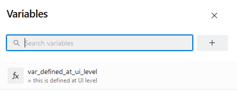
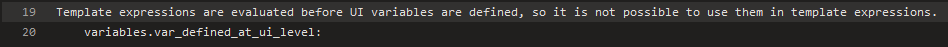

# Template expressions (aka compile-time expressions)

## Usable on the left side of a key

This allows you to define a task name using a variable. For [example](https://github.com/JakubLinhart/AzureDevOpsBattlefield/blob/9db84151d6a37aae91ebda190ad7ac7c662a51f7/pipelines/template-expressions.yml#L73):

```yaml
variables:
  - name: var_task_name
    value: 'pwsh'

steps:
  - ${{ variables.var_task_name }}: Write-Output 'Hello from a task defined by template expression.'
    displayName: The task name is defined by a template expression
```

Then the output is:

[](https://dev.azure.com/linj/AzureDevOpsBattleground/_build/results?buildId=260&view=logs&j=0ab14b9f-e499-56d5-97b1-fd98b70ea339&t=bd5b3379-fc2b-58be-675b-6db955a3e723).

## UI-defined variables are unavailable in template expressions

In Azure DevOps, template expressions are evaluated before the variables defined at the UI level are included. However, UI-defined variables are accessible for both [runtime expressions](/#runtime-expressions) and [macros](/#macros).

If you have a variable defined on the UI level:



then for [example]([TBD](https://github.com/JakubLinhart/AzureDevOpsBattlefield/blob/9db84151d6a37aae91ebda190ad7ac7c662a51f7/pipelines/template-expressions.yml#L51C82-L51C106)):

```yaml
  - pwsh: |
    Write-Output ''
    Write-Output 'Template expressions are evaluated before UI variables are defined, so it is not possible to use them in template expressions.'
    Write-Output '    variables.var_defined_at_ui_level: ${{ variables.var_defined_at_ui_level }}'
```

and the output is:

[](https://dev.azure.com/linj/AzureDevOpsBattleground/_build/results?buildId=262&view=logs&j=0ab14b9f-e499-56d5-97b1-fd98b70ea339&t=5e8f27c5-64d0-5083-9c85-d2ff9773c863&l=19)

## An undefined variable is evaluated as an empty string

TBD

## Can contain `if`

TBD

## The order of variable definitions is important

TBD

## Nested evaluation is NOT supported

TBD