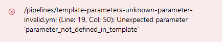
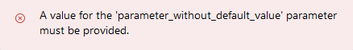

# Template parameters

## Unknown parameters cannot be passed to strongly typed templates

Consider this strongly typed [template](https://github.com/JakubLinhart/AzureDevOpsBattlefield/blob/9ecd2d4b62ecbcca416f5729238c2aca64e619c5/pipelines/template-parameters-strong.yml) `template-parameters-strong.yml` with a parameter `parameter1`:

```yaml
parameters:
  - name: parameter1
    type: string
    default: 'parameter1 default value'
```

If you try to pass a parameter that is not defined in the template from a [pipeline YAML](https://github.com/JakubLinhart/AzureDevOpsBattlefield/blob/9ecd2d4b62ecbcca416f5729238c2aca64e619c5/pipelines/template-parameters-unknown-parameter-invalid.yml):

```yaml
steps:
  - template: template-parameters-strong.yml
    parameters:
      parameter1: 'value of parameter1'
      parameter_not_defined_in_template: 'value of parameter not defined in template'
```

then you will get an error when you try to run the pipeline:

[](https://dev.azure.com/linj/AzureDevOpsBattleground/_build?definitionId=17&_a=summary) 

## All parameters without a default value must be specified for strongly typed templates

Consider this strongly typed [template](https://github.com/JakubLinhart/AzureDevOpsBattlefield/blob/5ba2104901341953f6e44041d0869ba6680aece2/pipelines/template-parameters-strong.yml) `template-parameters-strong.yml` with a parameter without a default value:

```yaml
parameters:
  - name: parameter_without_default_value
    type: string
```

If you don't specify `parameter_without_default_value` for the template from a [pipeline YAML]():

```yaml
steps:
  - template: template-parameters-strong.yml
```

Then you cannot start the pipeline, because of this error:

[](https://dev.azure.com/linj/AzureDevOpsBattleground/_build?definitionId=18&_a=summary)

## Unknown parameters can be passed to weakly typed templates

TBD

## Unspecified parameters without a default value are evaluated as an empty string in weakly typed templates

TBD

## Template expressions cannot be used for parameter defaults

TBD

## A template expression can specify a template name

TBD
