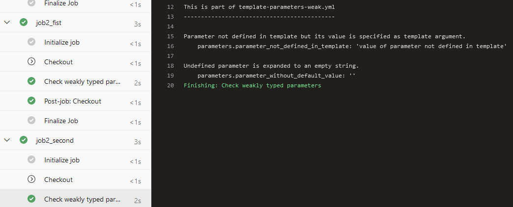

# Template parameters

## Unknown parameters cannot be passed to strongly typed templates

Consider this strongly typed [template](https://github.com/JakubLinhart/AzureDevOpsBattlefield/blob/9ecd2d4b62ecbcca416f5729238c2aca64e619c5/pipelines/template-parameters-strong.yml) `template-parameters-strong.yml` with a parameter `parameter1`:

```yaml
parameters:
  - name: parameter1
    type: string
    default: 'parameter1 default value'
```

If you try to pass a parameter that is not defined in the template from a [pipeline YAML](https://github.com/JakubLinhart/AzureDevOpsBattlefield/blob/9ecd2d4b62ecbcca416f5729238c2aca64e619c5/pipelines/template-parameters-unknown-parameter-invalid.yml):

```yaml
steps:
  - template: template-parameters-strong.yml
    parameters:
      parameter1: 'value of parameter1'
      parameter_not_defined_in_template: 'value of parameter not defined in template'
```

then you will get an error when you try to run the pipeline:

[](https://dev.azure.com/linj/AzureDevOpsBattleground/_build?definitionId=17&_a=summary) 

## All parameters without a default value must be specified for strongly typed templates

Consider this strongly typed [template](https://github.com/JakubLinhart/AzureDevOpsBattlefield/blob/5ba2104901341953f6e44041d0869ba6680aece2/pipelines/template-parameters-strong.yml) `template-parameters-strong.yml` with a parameter without a default value:

```yaml
parameters:
  - name: parameter_without_default_value
    type: string
```

If you don't specify `parameter_without_default_value` for the template from a [pipeline YAML](https://github.com/JakubLinhart/AzureDevOpsBattlefield/blob/main/pipelines/template-parameters-without-value-invalid.yml):

```yaml
steps:
  - template: template-parameters-strong.yml
```

Then you cannot start the pipeline, because of this error:

[](https://dev.azure.com/linj/AzureDevOpsBattleground/_build?definitionId=18&_a=summary)

## Unknown parameters can be passed to weakly typed templates

Consider a weakly typed [template](https://github.com/JakubLinhart/AzureDevOpsBattlefield/blob/77e1e2854686fa6e83e174a5bca09f0e8bf4aef2/pipelines/template-parameters-weak.yml):

```yaml
  parameters:
    parameter1: 'parameter1 default value'
    parameter_final: 'parameter name define by other parameter'
    job_suffix: 'first'

  steps:
    - pwsh: |
        Write-Output 'Parameter not defined in the template, but its value is specified as a template argument.'
        Write-Output '    parameters.parameter_not_defined_in_template: ''${{ parameters.parameter_not_defined_in_template }}'''
```

Then it is possible to pass a parameter to the template even though the parameter is not defined in the template. For [example](https://github.com/JakubLinhart/AzureDevOpsBattlefield/blob/77e1e2854686fa6e83e174a5bca09f0e8bf4aef2/pipelines/template-parameters.yml#L28):

```yaml
    - template: template-parameters-weak.yml
      parameters:
        job_suffix: 'fist'
        parameter_not_defined_in_template: 'value of parameter not defined in the template'
```

And the output is:

[](https://dev.azure.com/linj/AzureDevOpsBattleground/_build/results?buildId=311&view=logs&j=639dafd1-9d08-5ba3-6aa9-ec5498121476&t=24face41-f372-5a6c-3571-dd84dc13970b&l=16)

## Unspecified parameters without a default value are evaluated as an empty string in weakly typed templates

TBD

## Template expressions cannot be used for parameter defaults

Consider a strongly typed [template](https://github.com/JakubLinhart/AzureDevOpsBattlefield/blob/104d84b7a8599073912138ab33db3f72fedc3702/pipelines/template-parameters-strong-default-with-expression-invalid-template.yml) with these parameters and containing template expressions in default value definitions:

```yaml
  parameters:
    - name: parameter_with_template_expression_in_default
      type: string
      default: ${{ parameters.parameter1 }}
    - name: parameter_with_template_expression_in_default
      type: string
      default: ${{ variables.var_some_variable }}
```

If you try to start a pipeline using such a template, you will get this error:

[](https://dev.azure.com/linj/AzureDevOpsBattleground/_build?definitionId=19&_a=summary)

The same limitation applies to weakly typed [templates](https://github.com/JakubLinhart/AzureDevOpsBattlefield/blob/main/pipelines/template-parameters-weak-default-with-expression-invalid-template.yml) and the related [pipeline](https://dev.azure.com/linj/AzureDevOpsBattleground/_build?definitionId=20&_a=summary).

## Runtime expressions cannot reference parameters

Consider this weakly typed [template](https://github.com/JakubLinhart/AzureDevOpsBattlefield/blob/55beb685f924d546a0cb58130dfea3d000e35c29/pipelines/template-parameters-weak-runtime-expression-with-parameter-invalid-template.yml) using a parameter in a runtime expression:

```yaml
  parameters:
    parameter_first_number: 3
    parameter_second_number: 3
  
  jobs:
    - job: job1
      variables:
        - name: var_with_runtime_expression_referencing_parameters
          value: $[eq(parameters.parameter_first_number, parameters.parameter_second_number)]
```

When you try to start a [pipeline](https://dev.azure.com/linj/AzureDevOpsBattleground/_build?definitionId=21&_a=summary) utilizing this template, then you get this error:

[](https://dev.azure.com/linj/AzureDevOpsBattleground/_build/results?buildId=305&view=results)

## A template expression can specify a template name

Template expressions are evaluated before including the content of a template, enabling dynamic usage of a template with a name defined by a variable.

Consider the following [pipeline](https://github.com/JakubLinhart/AzureDevOpsBattlefield/blob/3e1dc5cef42bc9e587294adfdd9ab6ea3dfc0926/pipelines/template-parameters.yml#L30):

```yaml
  variables:
    - name: var_template_name
      value: template-parameters-weak.yml

  jobs:
    - job: job1
      steps:
        - template: ${{ variables.var_template_name }}
          parameters:
            job_suffix: 'second'
            parameter_not_defined_in_template: 'value of parameter not defined in template'
```

In this case, the pipeline correctly executes the template-parameters-weak.yml template:

[](https://dev.azure.com/linj/AzureDevOpsBattleground/_build/results?buildId=308&view=logs&j=22c52269-d8a2-54ec-0d9c-8f4cb7759146&t=16dbadd7-cbd8-5619-9edd-8ba5df7dae3a&l=12)